# 🐞 BR-01: Не реализован `TopMain`

## ❗ Критичность (Priority): High

## ⚠️ Серьёзность (Severity): Critical

## 🔁 Шаги воспроизведения

1. Локально открыть сайт `21school.html`
2. Убедиться, что находишься в самом начале страницы

---

## ✅ Ожидаемый результат

Корректно отображается шапка(TopMain), согласно макету

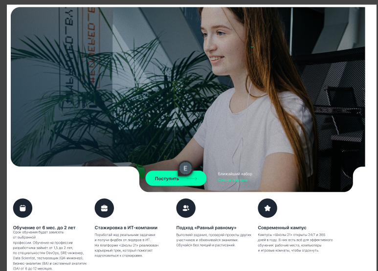

---

## ❌ Фактический результат

Присутствует кнопка "Поступить" и виден "Список городов", остальные элементы не реализованы.

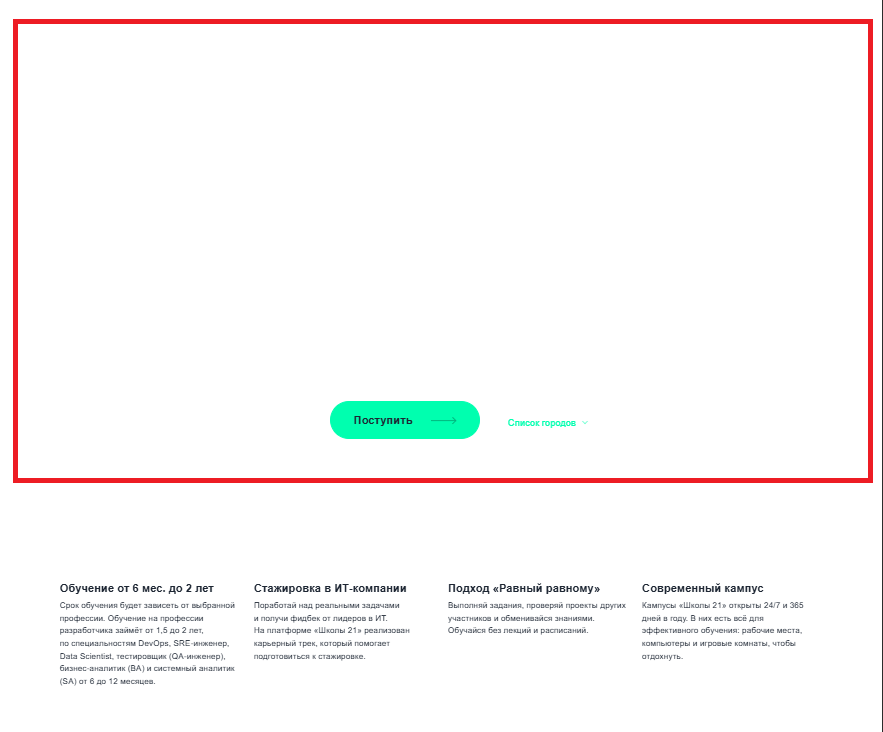

---

# 🐞 BR-02: `Advantages`, не отображаются иконки

## ❗ Критичность (Priority): High

## ⚠️ Серьёзность (Severity): Minor

## 🔁 Шаги воспроизведения

1. Локально открыть сайт `21school.html`
2. Просматривать страницу до пункта `Advantages (распологается сразу после шапки/TopMain)`

---

## ✅ Ожидаемый результат

Всё корректно отображается согласно макету

---

## ❌ Фактический результат

Отсутствуют иконки над пунктами с описанием

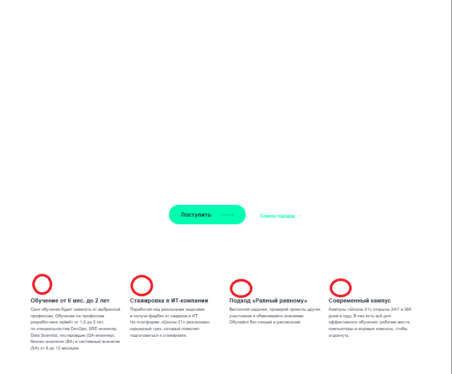

---

# 🐞 BR-03: `EducationProgram`, не соответствует макету

## ❗ Критичность (Priority): Medium

## ⚠️ Серьёзность (Severity): Minor

## 🔁 Шаги воспроизведения

1. Локально открыть сайт `21school.html`
2. Просматривать страницу до поля `"Программа обучения" (EducationProgram)`

---

## ✅ Ожидаемый результат

Всё отображается согласно макету

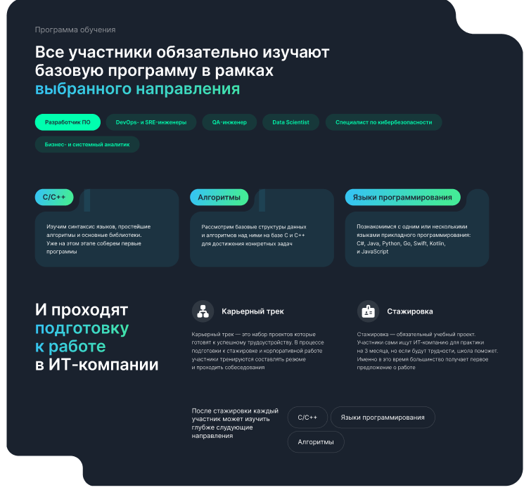

---

## ❌ Фактический результат

Отсутсвуют вырезы в правом верхнем и левом нижнем углах

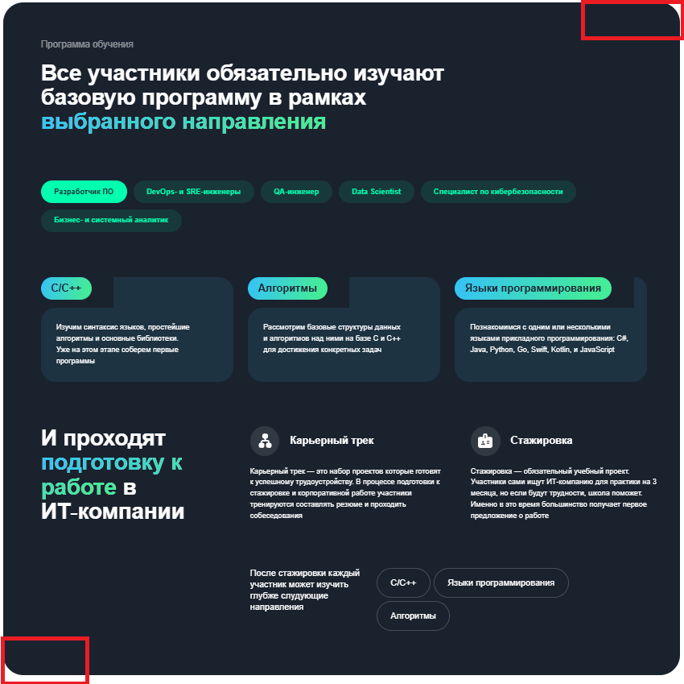

---

# 🐞 BR-04: `Admission`, не отображаются иконки

## ❗ Критичность (Priority): High

## ⚠️ Серьёзность (Severity): Minor

## 🔁 Шаги воспроизведения

1. Локально открыть сайт `21school.html`
2. Просматривать страницу до оглавления `В «Школу 21» может
поступить любой желающий (поле Admission)`

---

## ✅ Ожидаемый результат

Всё отображается корректно согласно макету

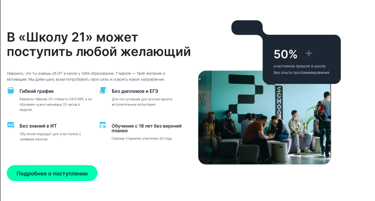

---

## ❌ Фактический результат

Не отображаются иконки в местах, указанных на скриншоте

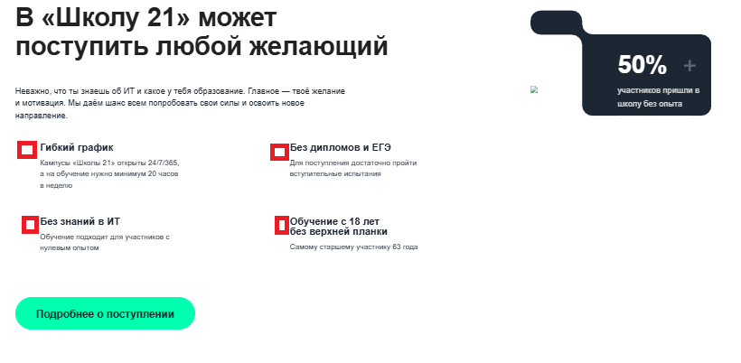

---

# 🐞 BR-05: `Admission`, не загружается изображение

## ❗ Критичность (Priority): High

## ⚠️ Серьёзность (Severity): Minor

## 🔁 Шаги воспроизведения

1. Локально открываем сай `21school.html`
2. Просматривать страницу до оглавления `В «Школу 21» может
поступить любой желающий (поле Admission)`

---

## ✅ Ожидаемый результат

Всё выглядит корректно согласно макету

---

## ❌ Фактический результат

Не прогружается изображение в месте, указаном на скриншоте. В файлах сборки присутствует

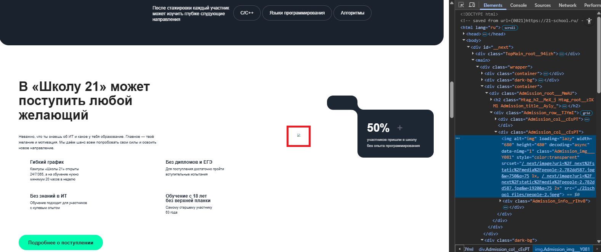

---

# 🐞 BR-06: `StagesAdmission`, не соответствует макету

## ❗ Критичность (Priority): Medium

## ⚠️ Серьёзность (Severity): Minor

## 🔁 Шаги воспроизведения

1. Локально открыть сайт `21school.html`
2. Просматривать страницу до поля `"Этапы поступления" (StagesAdmission)`

---

## ✅ Ожидаемый результат

Всё отображается корректно согласно макету

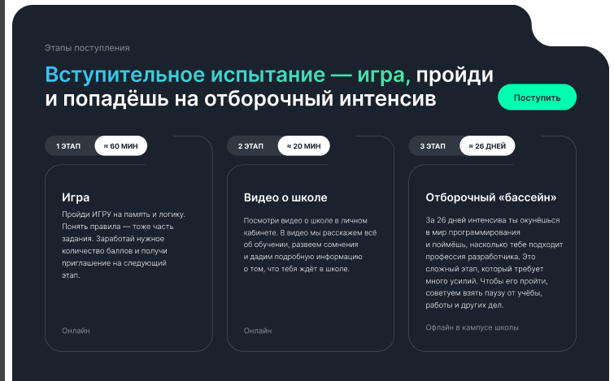

---

## ❌ Фактический результат

Отсутствует вырез в правом верхнем углу

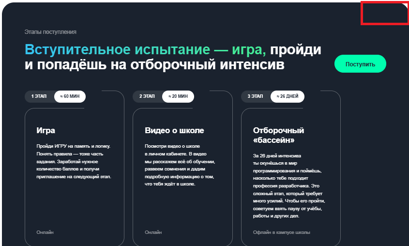

---

# 🐞 BR-07: `StartEducation`, не соответствует макету

## ❗ Критичность (Priority): High

## ⚠️ Серьёзность (Severity): Minor

## 🔁 Шаги воспроизведения

1. Локально открыть сайт `21school.html`
2. Просматривать страницу до поля `"Начало обучения" (StartEducation)`

---

## ✅ Ожидаемый результат

Всё выглядит корректно согласно макету

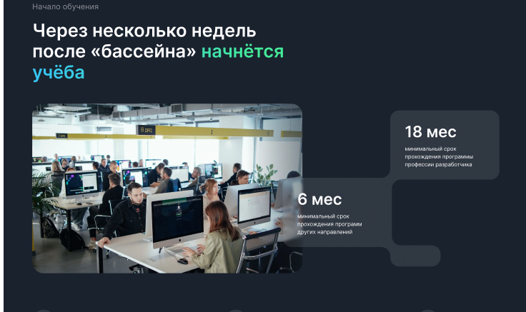

---

## ❌ Фактический результат

Некорректно произведена вёрстка элемента, указанного на скриншоте

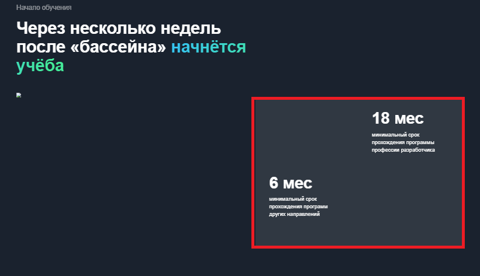

---

# 🐞 BR-08: `StartEducation`, не загружается изображение

## ❗ Критичность (Priority): High

## ⚠️ Серьёзность (Severity): Minor

## 🔁 Шаги воспроизведения

1. Локально открываем сайт `21school.html`
2. Просматриваем страницу до поля `"Начало обучения" (StartEducation)`

---

## ✅ Ожидаемый результат

Всё выглядит корректно согласно макету

---

## ❌ Фактический результат

Не прогружается изображение в месте, указанном на скриншоте. В файлах сборки присутствует

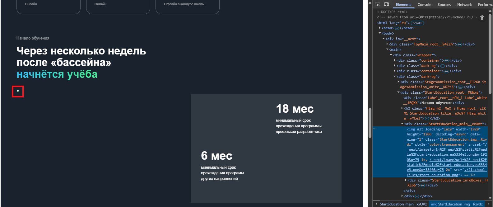

---

# 🐞 BR-09: `Method`, не соответствует макету

## ❗ Критичность (Priority): High

## ⚠️ Серьёзность (Severity): Major

## 🔁 Шаги воспроизведения

1. Локально открыть сайт `21school.html`
2. Просматривать страницу до поля `"Методология" (Method)`

---

## ✅ Ожидаемый результат

Всё выглядит согласно макету

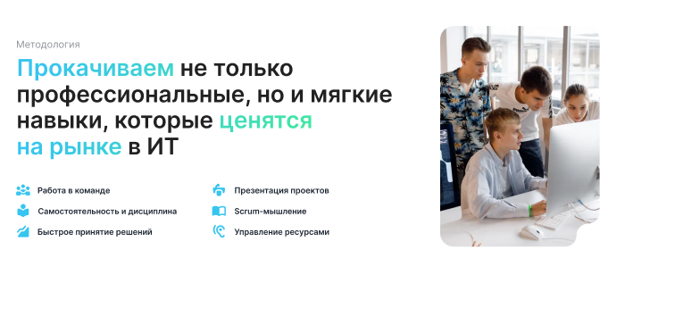

---

## ❌ Фактический результат

Присутствует кнопка `"Подробнее о методике"`, наличие которой не было согласовано на макете

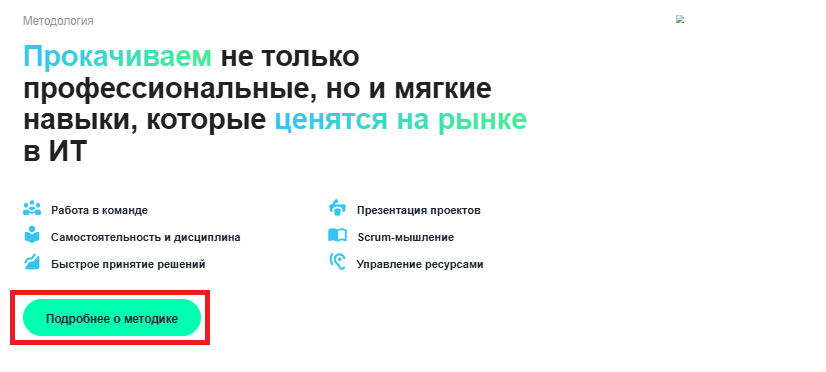

---

# 🐞 BR-10: `Method`, не загружается изображение

## ❗ Критичность (Priority): High

## ⚠️ Серьёзность (Severity): Minor

## 🔁 Шаги воспроизведения

1. Локально открыть сайт `21school.html`
2. Просматривать страницу до поля `"Методология" (Method)`

---

## ✅ Ожидаемый результат

Всё выглядит согласно макету

---

## ❌ Фактический результат

Не прогружается изображение в месте, указанном на скриншоте. В файлах сборки присутствует

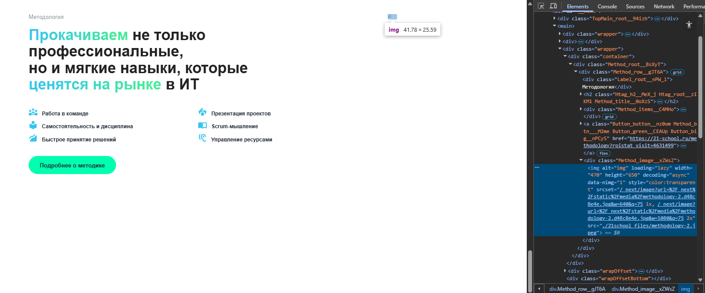

---

# 🐞 BR-11: Не реализован `CampusesMap`

## ❗ Критичность (Priority): High

## ⚠️ Серьёзность (Severity): Critical

## 🔁 Шаги воспроизведения

1. Локально открыть сайт `21school.html`
2. Просматривать страницу до поля `"Кампусы" (CampusesMap)`

---

## ✅ Ожидаемый результат

Всё выглядит согласно макету

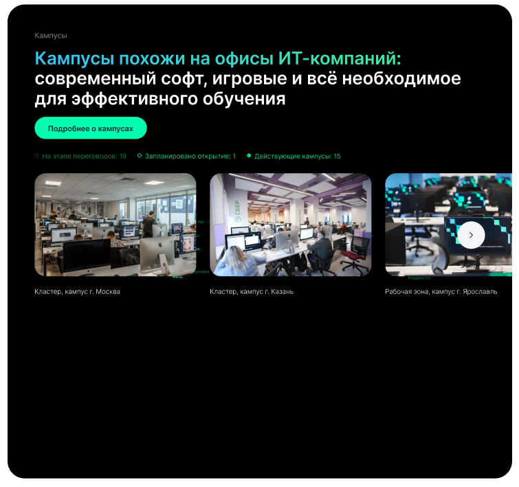

---

## ❌ Фактический результат

Полностью отсутствует поле `"Кампусы"`

---

# 🐞 BR-12: `Answers`, не соответствует макету

## ❗ Критичность (Priority): High

## ⚠️ Серьёзность (Severity): Major

## 🔁 Шаги воспроизведения

1. Локально открыть сайт `21school.html`
2. Просматриваем страницу до поля `"Ответы на вопросы" (Answers)`

---

## ✅ Ожидаемый результат

Всё выглядит согласно макету

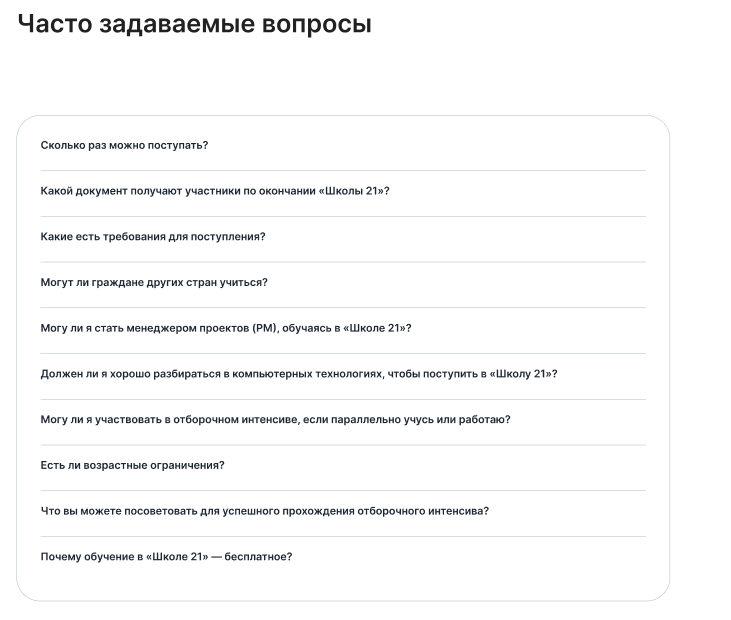

---

## ❌ Фактический результат

Присутствуют кнопки `"Поступление"` и `"Обучение"`, наличие которых не было согласовано на макете

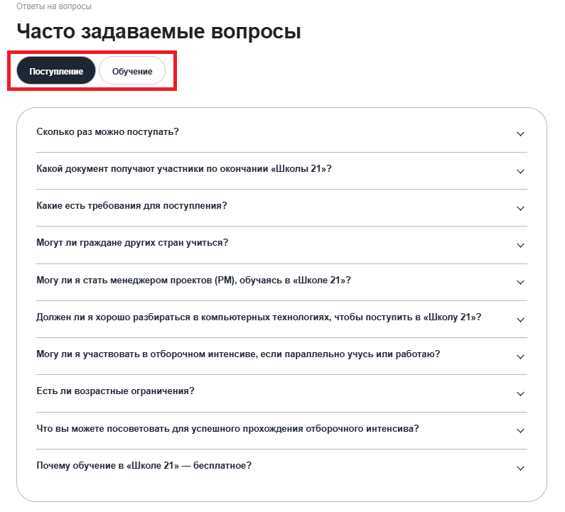
