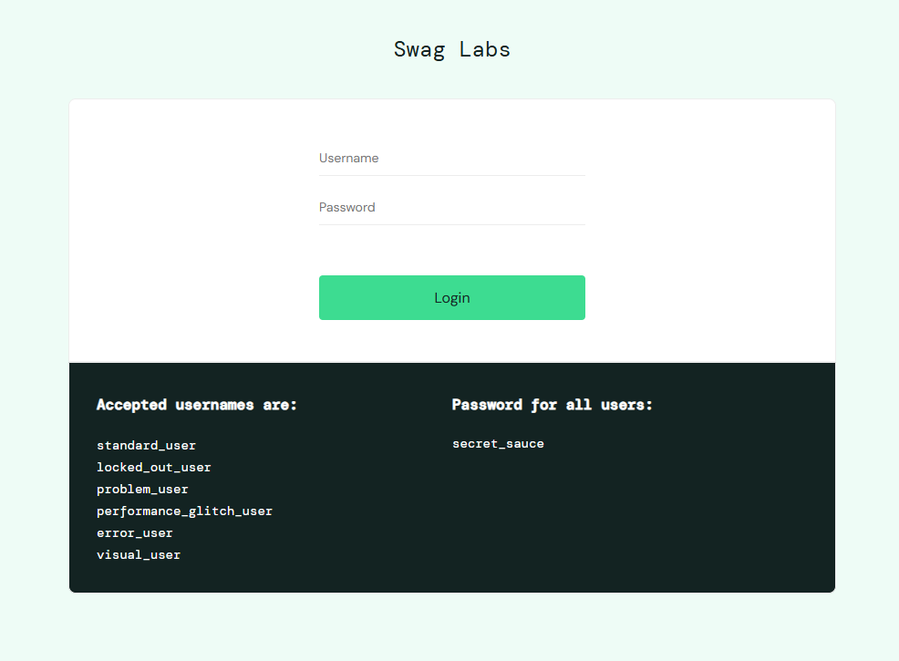
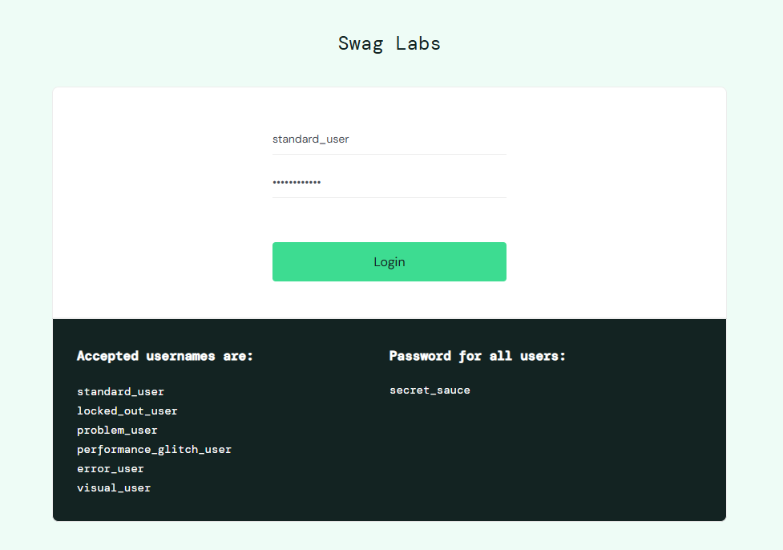
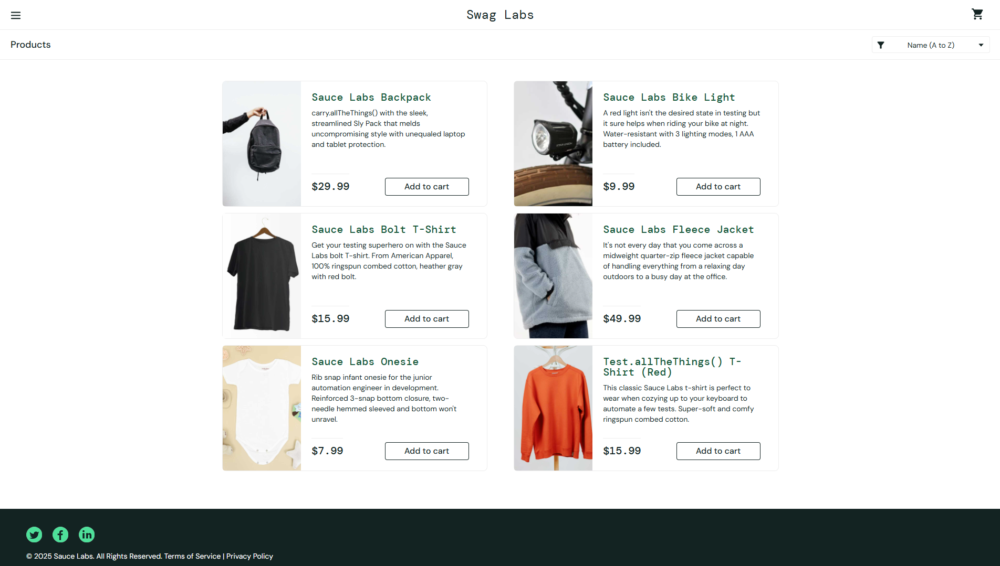
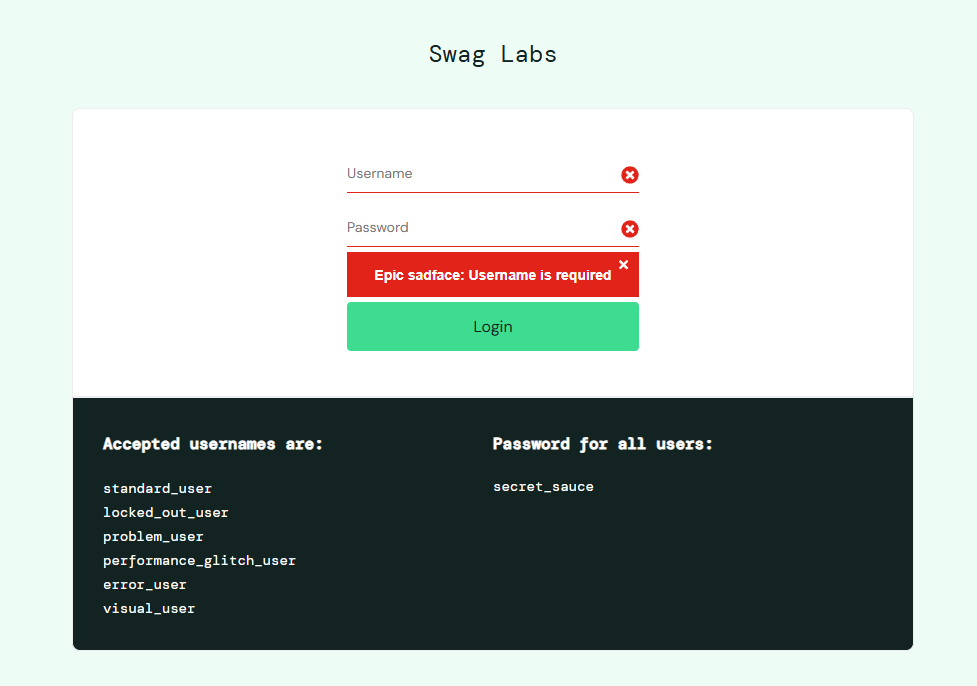
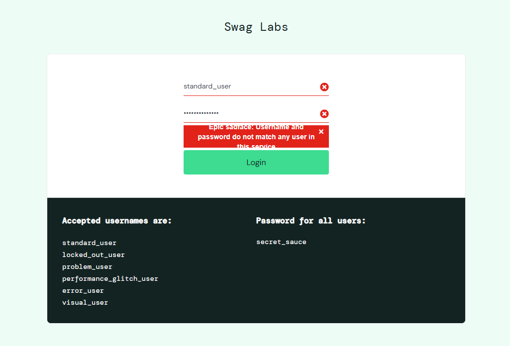

# Составить тест-кейс

## Позитивные тест-кейсы

### 01 Успешная авторизация
 
- **Предусловия:**  
  - Сайт `saucedemo.com` доступен  
  - Страница авторизации открыта в браузере  
  - Поля `Username` и `Password` пустые  

- **Шаги:**  
  1. В поле `Username` ввести `standard_user`  
  2. В поле `Password` ввести `secret_sauce`
  3. Нажать кнопку `Login`  
- **Ожидаемый результат:**  
  - Авторизация выполнена успешно
  - Выполнен переход на каталог товаров `/inventory.html`
- **Фактический результат:**  
  - Соответствует ожидаемому
  

---

## Негативные тест-кейсы

### 02 Ошибка авторизации при пустом Username и Password
 
- **Предусловия:**  
  - Сайт `saucedemo.com` доступен
  - Страница авторизации открыта в браузере 
  - Поля `Username` и `Password` пустые

- **Шаги:**  
  1. Не заполняя поля `Username` и `Password`, нажать кнопку `Login` 
- **Ожидаемый результат:**  
  - Авторизация не выполняется 
  - Отображается сообщение об ошибке:   
    `Epic sadface: Username is required`
  - Пользователь остаётся на странице авторизации 
- **Фактический результат:**  
  - Соответствует ожидаемому

---

### 03 Ошибка авторизации при неверном пароле
  
- **Предусловия:**  
  - Сайт `saucedemo.com` доступен  
  - Страница авторизации открыта в браузере 
  - Поля `Username` и `Password` пустые

 

- **Шаги:**  
  1. В поле `Username` ввести `standard_user`  
  2. В поле `Password` ввести неверный пароль, например `12345678`  
  3. Нажать кнопку `Login`  
- **Ожидаемый результат:**  
  - Авторизация не выполняется  
  - Отображается сообщение об ошибке:  
    `Epic sadface: Username and password do not match any user in this service`
  - Пользователь остаётся на странице авторизации  
- **Фактический результат:**  
  - Соответствует ожидаемому

