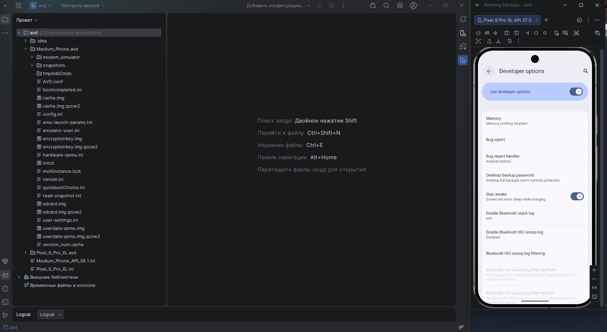
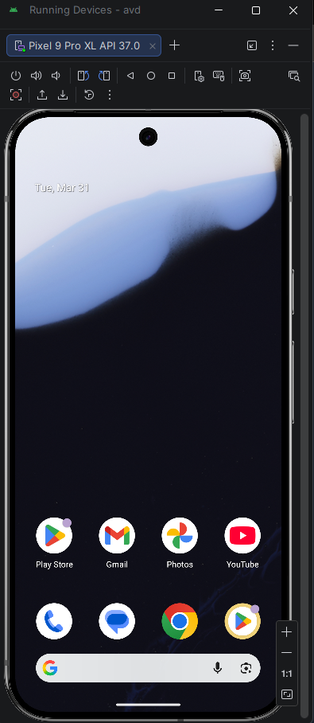
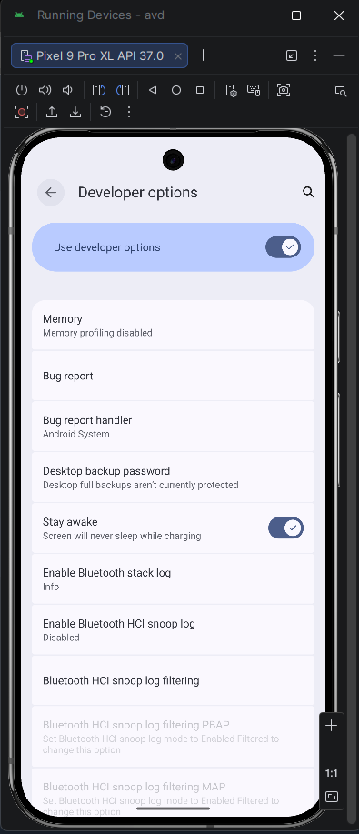
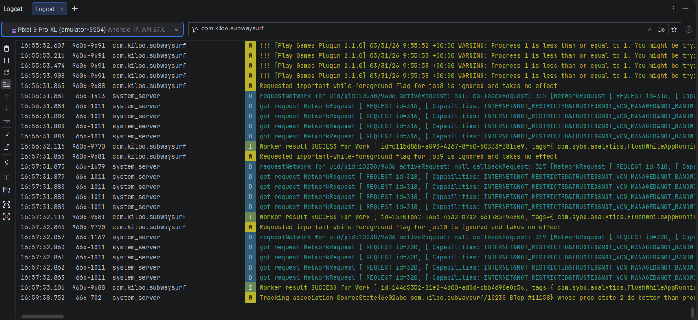

# Работа с Android Studio

## 1. Установка Android Studio

1. Скачать Android Studio с официального сайта.
2. Установить Android Studio с настройками по умолчанию.
3. При первом запуске установить необходимые компоненты SDK:
   - Android SDK
   - Android SDK Platform
   - Android SDK Build-Tools
   - Android Emulator
   - Intel HAXM / Hypervisor Driver (если предлагалось)

**Установленная Android Studio**

## 2. Создание эмулятора с поддержкой Play Market

1. Открыть Android Studio.
2. Перейти в:
   - `Tools -> Device Manager`
3. Нажать:
   - `Create device`
4. Выбрать устройство (например, **Pixel 7** / **Pixel 8**).
5. На шаге выбора системного образа выбрать **образ с пометкой Google Play**.
   - **Не любой образ содержит Play Market**.
6. Скачать выбранный system image.
7. Завершить создание эмулятора.
8. Нажать **Run / Start** у созданного AVD.
9. Убедиться, что эмулятор запустился и в системе доступен **Play Store**.

**Запущенный эмулятор с поддержкой Play Market**

## 3. Режим разработчика на Android

1. Открыть **Settings (Настройки)**.
2. Перейти в:
   - `About phone` / `О телефоне`
3. Найти пункт:
   - `Build number` / `Номер сборки`
4. Нажать на него **7 раз**.
5. После сообщения:
   - `You are now a developer!`
6. Вернуться назад.
7. Открыть:
   - `System -> Developer options`
   - или просто найти раздел **Для разработчиков / Developer options**

### На что важно обратить внимание

- На разных оболочках путь отличается:
  - **Pixel**: `Settings -> About phone -> Build number`
  - **Samsung**: `Settings -> About phone -> Software information -> Build number`
- Для Android 4.2+ раздел разработчика скрыт по умолчанию и включается только через 7 нажатий по номеру сборки.
- Для отладки приложений часто дополнительно включают:
  - **USB debugging / Отладка по USB**

**Раздел "Для разработчиков" с включённым режимом**

## 4. Logcat и снятие логов

**Logcat** — это инструмент Android Studio для просмотра логов устройства/эмулятора в реальном времени.  
**Позволяет:** 

- отслеживать сообщения приложения;
- видеть системные события;
- анализировать ошибки и stack trace;
- искать причины падений приложения.

### Как открыть

1. Запустить приложение на эмуляторе или устройстве.
2. Открыть:
   - `View -> Tool Windows -> Logcat`
   - либо нижнюю панель **Logcat**

### Пример логов, которые можно увидеть

- `ActivityTaskManager`
- `System.out`
- `I/MainActivity`
- предупреждения (`W`)
- ошибки (`E`)
- исключения (stack trace), если приложение падает

*Полезно использовать фильтры:*

- по имени пакета
- по уровню логов: `Verbose`, `Debug`, `Info`, `Warn`, `Error`

**Окно Logcat с зафиксированными логами**

## 5. Инструкция по созданию симулятора в Xcode

### Шаги

1. Открой Xcode и дождись завершения начальной настройки.
2. Перейди в меню **Window → Devices and Simulators**.
3. Открой вкладку **Simulators**.
4. Нажми кнопку **+** и создай новый симулятор.
5. Укажи:
   - **Name** — имя симулятора.
   - **Device Type** — модель устройства.
   - **iOS Version** — нужную версию системы.
6. Если нужной версии iOS нет в списке, открой **Xcode → Settings → Components** и скачай необходимый runtime.
7. Выбери созданный симулятор в списке запуска рядом с кнопкой **Run**.
8. Нажми **Run** и проверь, что приложение открылось в симуляторе.

### На что важно обращать внимание

- Проверь, что выбраны **и модель устройства, и версия iOS** — от этого зависит корректность теста.
- Если симулятор не появился, сначала убедись, что **нужный runtime установлен**.
- После установки нового runtime иногда помогает **перезапуск Xcode**.
- Для более точной проверки можно настраивать поведение симулятора через **Edit Scheme**.
- Не ставь лишние runtimes без необходимости — они занимают место и засоряют список.

### Короткая памятка

- **Создать симулятор:** `Window → Devices and Simulators → Simulators → +`
- **Установить версию iOS:** `Xcode → Settings → Components`
- **Запустить:** выбрать симулятор в scheme и нажать **Run**
