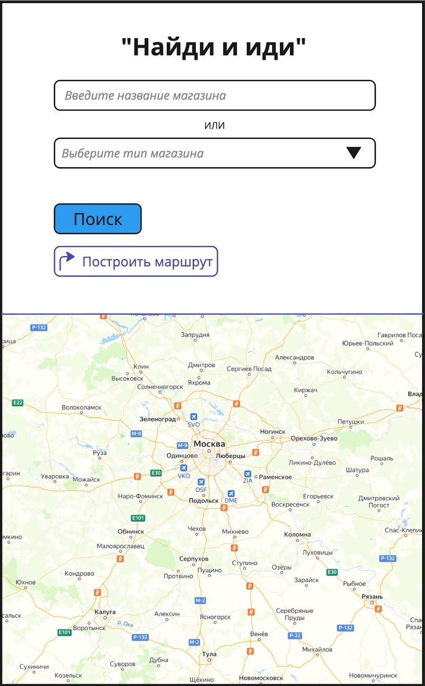

# Тестирование документации

## Техническое задание на приложение «Найди и иди»

Приложение «Найди и иди» предназначено для поиска нужного пользователям магазина и построения маршрута до него. Для упрощения задания считаем, что геолокация всегда разрешена приложению.

### Требования

|**ID требования**|**Описание требования**|
| - | - |
|SC21-01|**Поле ввода названия магазина** - Поле ввода названия магазина принимает любые символы. - Поле содержит плейсхолдер. - Плейсхолдер исчезает при вводе символов. - Минимальное количество символов — 2. - В поле сохраняются результаты предыдущих поисков.|
|SC21-02|**Поле выбора типа магазина** - Поле выбора типа магазина представляет собой выпадающее меню со следующими вариантами выбора значений: 1. «Продуктовые магазины»; 2. «Магазины стройматериалов»; 3. «Аптеки»; и т.п. - Поле содержит плейсхолдер «Выберите тип магазина». - При наличии выбранного значения оно отображается в поле.|
|SC21-03|**Кнопка «Поиск»** - Кнопка «Поиск» активна только в случае заполнения минимум одного поля (некликабельна при отсутствии заполнения обоих полей). - Успешные результаты поиска отображаются в виде флажков на карте. - Карту можно скроллить и зуммировать (стандартные жесты).|
|SC21-04|**Кнопка «Построить маршрут»** - Кнопка «Построить маршрут» активна в следующих случаях: 1. Найден результат поиска введенного пользователем названия магазина и выбран его флаг на карте. 2. Выбран тип магазина (маршрут будет построен до ближайшего магазина с указанным типом). - Кнопка содержит иконку в виде изогнутой стрелки,  надпись «Построить маршрут» и цвет фона #fff (белый). - При нажатии на кнопку цвет фона меняется на #586d73 (серый) и название кнопки меняется с «Построить маршрут» на «Отменить маршрут».|
|SC21-05|**Область карты** - Область карты занимает половину области экрана телефона. - Для построения маршрута требуется выполнение условий в требовании **SC21-04**. - Построенный маршрут можно отменить только нажатием кнопки «Отмена».|
|SC21-06|**Общие требования к работе приложения** - При повторном открытии приложения отображать незаконченный ранее маршрут. - Отключать точную геопозицию при низком заряде аккумулятора.|

---

## Результаты тестирования технической документации

Анализ требований выполнен по **4 основным критериям качества требований**:

- **Полнота** — достаточно ли информации для реализации и тестирования;
- **Однозначность** — исключает ли формулировка разные трактовки;
- **Непересекаемость** — не дублирует ли требование другие требования и не противоречит ли им;
- **Атомарность** — описывает ли требование одну законченную проверяемую мысль.

---

### 1. SC21-01 — Поле ввода названия магазина

**Фраза с ошибкой:** «Поле ввода названия магазина принимает любые символы.»  
**Критерий:** Однозначность

- Формулировка «любые символы» допускает разные трактовки (спецсимволы, emoji, HTML, SQL).
- Требование невозможно однозначно проверить.

**Фраза с ошибкой:** «Минимальное количество символов — 2.»  
**Критерий:** Непересекаемость  

- Условие минимального количества символов влияет на активацию кнопки «Поиск», но логика активации описана отдельно в SC21-03.
- Требования пересекаются и могут интерпретироваться противоречиво.

**Фраза с ошибкой:** «В поле сохраняются результаты предыдущих поисков.»  
**Критерий:** Полнота  

- Не указано, где и как хранятся результаты.
- Не описан механизм отображения и ограничения по количеству сохранённых значений.

---

### 2. SC21-02 — Поле выбора типа магазина

**Фраза с ошибкой:** «и т.п.»  
**Критерий:** Однозначность  

- Использование «и т.п.» не позволяет определить полный список значений.
- Невозможно проверить корректность реализации.

**Фраза с ошибкой:** «Поле выбора типа магазина представляет собой выпадающее меню…» (весь пункт)  
**Критерий:** Атомарность  

- В одном требовании объединены описание UI-элемента, список значений и правила отображения.
- Для соблюдения атомарности пункт должен быть разбит на несколько требований.

---

### 3. SC21-03 — Кнопка «Поиск»

**Фраза с ошибкой:** «Кнопка «Поиск» активна только в случае заполнения минимум одного поля.»  
**Критерий:** Однозначность  

- Не определено, что считается заполнением поля (пробелы, один символ).
- Неясно, учитывается ли ограничение минимальной длины из SC21-01.

**Фраза с ошибкой:** «Успешные результаты поиска отображаются в виде флажков на карте.»  
**Критерий:** Полнота  

- Не описано, что считается успешным результатом.
- Не указано поведение при отсутствии результатов.

---

### 4. SC21-04 — Кнопка «Построить маршрут»

**Фраза с ошибкой:** «Кнопка «Построить маршрут» активна в следующих случаях…»  
**Критерий:** Атомарность  

- В одном требовании описаны условия активности, внешний вид и поведение кнопки.
- Требование следует разделить на логические части.

**Фраза с ошибкой:** «Найден результат поиска… и выбран его флаг на карте.»  
**Критерий:** Полнота  

- Не описано поведение при нескольких результатах.
- Не указано, возможен ли выбор нескольких флагов.

---

### 5. SC21-05 — Область карты

**Фраза с ошибкой:** «Область карты занимает половину области экрана телефона.»  
**Критерий:** Однозначность  

- Не указано, какую именно половину экрана занимает карта.
- Не описано поведение при смене ориентации экрана.

**Фраза с ошибкой:** «Построенный маршрут можно отменить только нажатием кнопки «Отмена»»  
**Критерий:** Непересекаемость  

- Логика отмены маршрута уже частично описана в SC21-04.
- Требования дублируют друг друга.

---

### 6. SC21-06 — Общие требования

**Фраза с ошибкой:** «Отображать незаконченный ранее маршрут.»  
**Критерий:** Однозначность  

- Не определено, что считается незавершённым маршрутом.
- Возможны разные трактовки у разработчиков и тестировщиков.

**Фраза с ошибкой:** «Отключать точную геопозицию при низком заряде аккумулятора.»  
**Критерий:** Полнота  

- Не указан порог низкого заряда.
- Не описано, кто управляет отключением (приложение или ОС).
