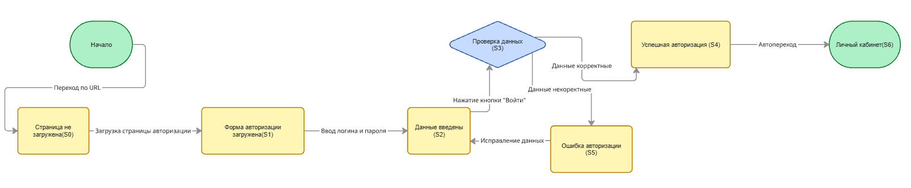

# Таблица переходов и состояний

## Страница авторизации

URL: <https://applicant.21-school.ru/auth>

Ниже представлена таблица состояний и переходов, а также визуальная диаграмма состояний для страницы авторизации.

---

## Таблица состояний и переходов

| Текущее состояние | Событие / условие | Действие системы | Следующее состояние |
|-------------------|------------------|------------------|---------------------|
| S0: Страница не загружена | Переход по URL | Загрузка страницы авторизации | S1: Форма авторизации загружена |
| S1: Форма авторизации загружена | Ввод логина и пароля | Валидация формата данных | S2: Данные введены |
| S2: Данные введены | Нажатие кнопки «Войти» | Отправка данных на сервер | S3: Проверка данных |
| S3: Проверка данных | Данные корректны | Создание сессии пользователя | S4: Успешная авторизация |
| S3: Проверка данных | Данные некорректны | Отображение сообщения об ошибке | S5: Ошибка авторизации |
| S5: Ошибка авторизации | Исправление данных | Очистка сообщения об ошибке | S2: Данные введены |
| S4: Успешная авторизация | Автопереход | Редирект в личный кабинет | S6: Личный кабинет |

---

