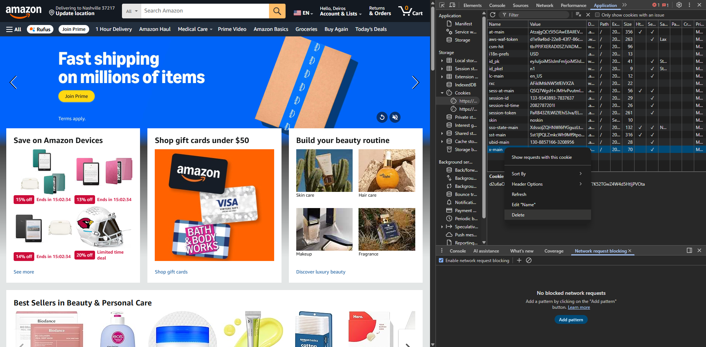
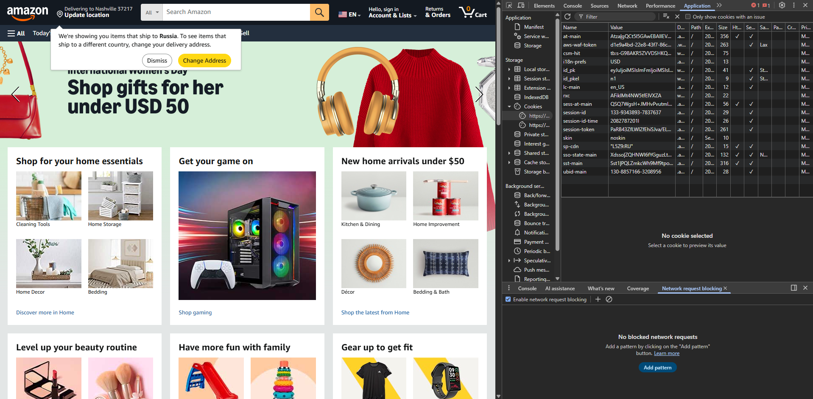

# Cookies

## 1. Адрес сайта

Сайт: Amazon  
<https://www.amazon.com>

---

## 2. Анализ ключевых cookies

### 1️⃣ x-main

- Тип: String (токен)
- Назначение: Cookie аутентификации пользователя (поддерживает состояние входа)

Флаги:

- Secure: ✅
- HttpOnly: ❌
- SameSite: не указан

Оценка безопасности:
Отсутствие HttpOnly — это потенциальный риск. Cookie доступен через JavaScript,
что делает его уязвимым при XSS-атаке.  
Для аутентификационного cookie рекомендуется устанавливать HttpOnly.

---

### 2️⃣ session-id

- Тип: String
- Назначение: Идентификатор пользовательской сессии

Флаги:

- Secure: ✅
- HttpOnly: ❌
- SameSite: не указан

Оценка безопасности:
Идентификатор сессии без HttpOnly — нежелательная конфигурация.
При наличии XSS злоумышленник сможет получить session-id.

---

### 3️⃣ session-token

- Тип: String (token)
- Назначение: Дополнительный токен безопасности сессии

Флаги:

- Secure: ✅
- HttpOnly: ❌
- SameSite: не указан

Также отсутствует HttpOnly — потенциальный риск.

---

### 4️⃣ ubid-main

- Тип: String
- Назначение: Уникальный идентификатор устройства

Флаги:

- Secure: ✅
- HttpOnly: ❌

Не содержит критичных данных аутентификации.

---

### 5️⃣ i18n-prefs

- Тип: String
- Назначение: Хранит региональные настройки (USD)

Флаги:

- Secure: ❌
- HttpOnly: ❌

Не является чувствительным cookie.

---

## 3. Добавление товара в корзину

После добавления товара в корзину:

- Изменилось значение cookie `session-id`

Предположительно, корзина привязана к `session-id`, но напрямую в нём не записано значение. Сама корзина привязана непосредственно к ID, которое хранится на сервере Амазона и уже там записываются все изменения.

---

## 4. Удаление cookie аутентификации

Был удалён cookie `x-main`

После обновления страницы:

- Пользователь был разлогинен
- Сайт потребовал повторную авторизацию

