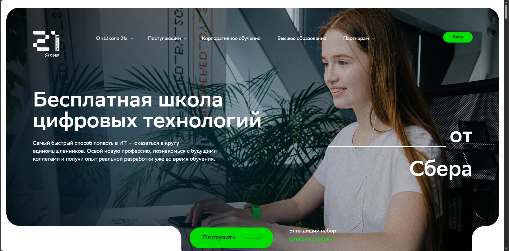
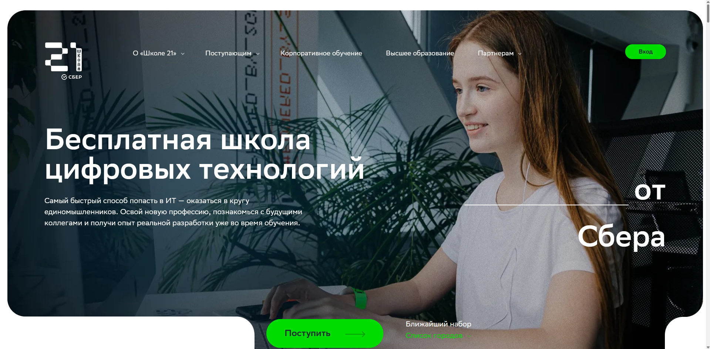
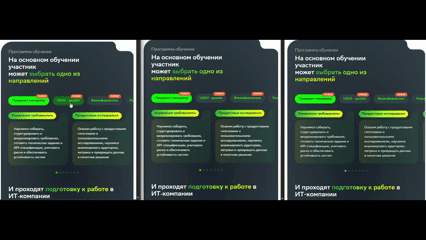
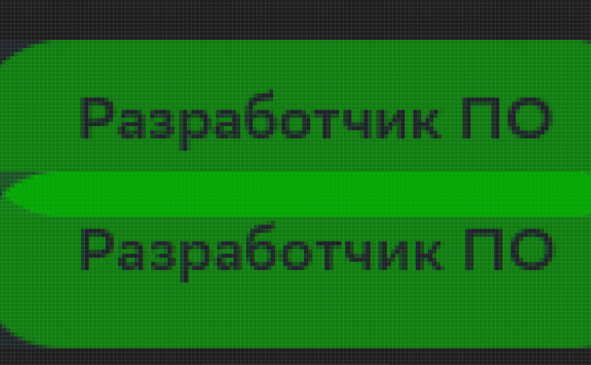
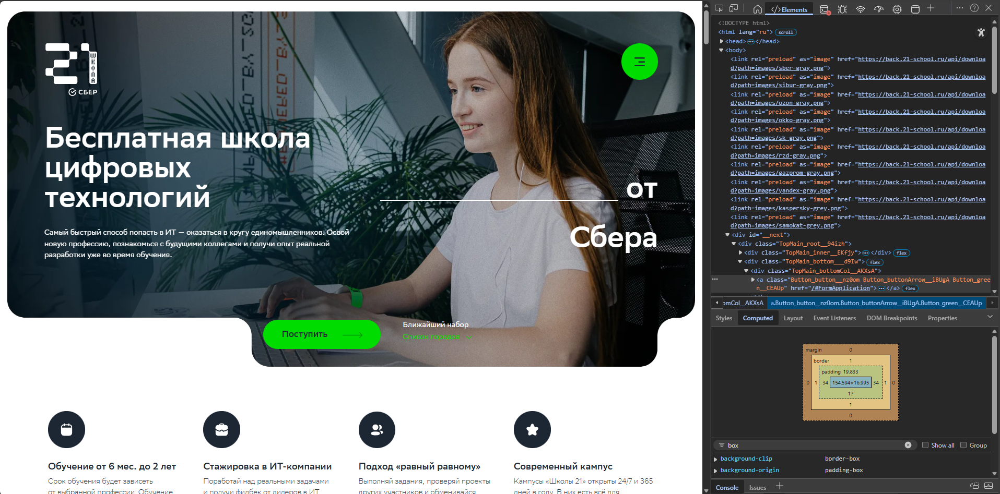
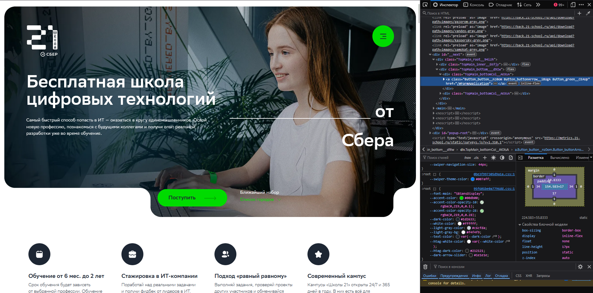

# Кроссбраузерное тестирование сайта <https://21-school.ru/>

**Проверяемые браузеры:**  

- Google Chrome (движок Chromium)
- Microsoft Edge (движок Chromium)  
- Mozilla Firefox (движок Gecko)

---

## 1. Результаты тестирования

| Проверяемый элемент | Конкретное отличие (что различается и в каких браузерах) | Предполагаемая техническая причина отличия | Скриншоты |
|---|---|---|---|
| **Прогрузка изображений** | В Firefox изображения прогружаются плавной «шторкой» сверху вниз. В Chrome и Edge загрузка происходит фрагментами (кусочно). | Различия в алгоритмах progressive rendering и обработке lazy-loading в движках Gecko и Chromium. | См. Скриншот 1 |
| **Центровка контента относительно окна браузера** | В Chrome и Edge центрирование происходит относительно видимой области окна. В Firefox вертикальный scrollbar учитывается как часть страницы, из-за чего визуально контент слегка смещён. | Различия в расчёте ширины viewport и обработке `100vw`, а также учёт scrollbar в layout-движке Gecko. | См. Скриншоты 2 и 3 |
| **Переключение элементов (анимации/слайды/hover)** | В Firefox переключение элементов визуально более плавное. В Chrome и Edge анимации выглядят более резкими. | Разная интерпретация CSS `transition`, `animation` и аппаратного ускорения в Gecko и Chromium. | См. Скриншот 4 |
| **Текст разделов и кнопок** | Толщина и чёткость шрифтов слегка различаются: в Firefox текст отображается более тонким по сравнению с Chrome и Edge (как в заголовках, так и в кнопках). | Различия в рендеринге шрифтов, сглаживании (anti-aliasing), алгоритмах subpixel rendering и интерпретации `font-weight` в движках Gecko и Chromium. | См. Скриншоты 5 |
| **Кнопка «Поступить»** | В Firefox размер кнопки отличается от Chrome и Edge (кнопка визуально немного отличается по габаритам), что связано с особенностями отображения и плавности анимаций. | Различия в обработке CSS-анимаций, вычислении размеров элементов, `line-height` и округлении пикселей в разных браузерных движках (связано с пунктом про переключение элементов). | См. Скриншоты 6 и 7 |

---

## 2. Скриншоты обнаруженных различий

### Скриншот 1 — Прогрузка изображений

---

### Скриншот 2 — Центровка контента (Chrome/Edge)

---

### Скриншот 3 — Центровка контента (Firefox)

---

### Скриншот 4 — Переключение элементов

---

### Скриншот 5 — Текст

---

### Скриншот 6 — Кнопка "Поступить" (Chrome/Edge)

---

### Скриншот 7 — Кнопка "Поступить" (Firefox)

---

## 3. Рекомендации по обеспечению кроссбраузерной совместимости

1. **Явно задавать размеры и отступы в пикселях с учётом возможного округления**, а также проверять отображение padding и line-height в разных браузерах.

2. **Использовать CSS Normalize или Reset**, чтобы минимизировать различия базовых стилей браузеров.

3. **Избегать использования 100vw без учёта scrollbar**, либо применять `calc()` и альтернативные методы центрирования для корректной работы во всех движках.

4. **Тестировать анимации и шрифты на разных движках (Gecko и Chromium)** и при необходимости настраивать сглаживание шрифтов и параметры transition для более одинакового визуального поведения.

---

## 4. Вывод

В ходе тестирования сайта были выявлены незначительные визуальные различия в отображении элементов интерфейса в браузерах Chrome, Edge и Firefox. Большинство отличий связано с особенностями работы движков Gecko и Chromium: различиями в расчётах viewport, округлении пикселей, рендеринге шрифтов и анимаций. Несмотря на то что различия не критичны, их устранение позволит улучшить единообразие пользовательского опыта на разных платформах.
