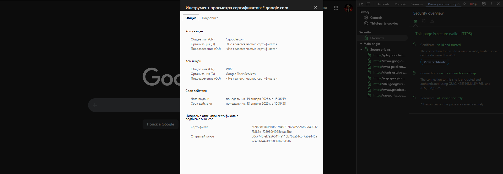
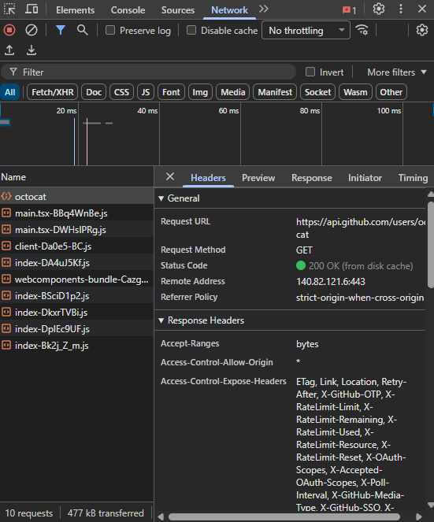
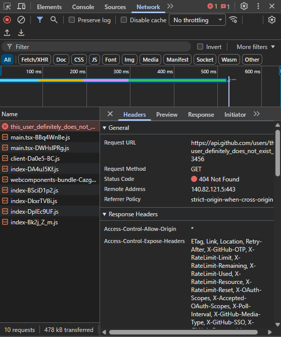

# HTTPS, TLS, HTTP Status Codes

## 1. Установление защищённого HTTPS‑соединения (TLS Handshake)

1. **ClientHello**
   - **Цель:** браузер сообщает серверу, что хочет установить защищённое соединение.
   - **Что передаётся:** поддерживаемые версии TLS, наборы шифров, random, SNI (имя сайта).
   - **Какой риск устраняет:** предотвращает использование слабых/устаревших алгоритмов.

2. **ServerHello**
   - **Цель:** сервер выбирает параметры шифрования.
   - **Что передаётся:** выбранная версия TLS, шифр, random сервера.
   - **Риск:** исключает downgrade‑атаки (принудительное понижение TLS).

3. **Передача сертификата сервера**
   - **Цель:** доказать подлинность сервера.
   - **Что внутри:** публичный ключ сервера, доменное имя, CA, срок действия.
   - **Риск:** защита от MITM‑атак (подмена сервера).

4. **Проверка сертификата браузером**
   - **Цель:** убедиться, что сертификат доверенный.
   - **Проверки:** цепочка доверия, домен, срок действия, отзыв (CRL/OCSP).
   - **Риск:** подключение к поддельному сайту.

5. **Обмен ключами (Key Exchange)**
   - **Цель:** безопасно создать общий симметричный ключ.
   - **Примеры:** ECDHE, RSA (устар.).
   - **Риск:** перехват ключей шифрования.

6. **Finished (Handshake complete)**
   - **Цель:** подтвердить, что стороны договорились о ключах.
   - **Риск:** атаки на целостность handshake.

7. **Шифрованный HTTP‑трафик**
   - **Цель:** безопасная передача данных.
   - **Риск:** перехват, подмена, чтение данных.

---

## 2. Анализ сертификата HTTPS‑сайта

**Анализируемый сайт:** <https://google.com>

### Данные сертификата

- **Версия TLS:** 1.3
- **Кто выпустил сертификат (Issuer):** Google Trust Services
- **Срок действия:** с 19.01.2026 по 13.04.2026
- **Статус:** действителен

### Скриншот сертификата



### Какие этапы HTTPS видны пользователю

- Проверка сертификата — **видна** (замок)
- Ошибки доверия — **видны**

### Какие этапы скрыты в браузере

- ClientHello / ServerHello
- Обмен ключами
- Проверка целостности handshake

---

## 3. HTTP Status Codes — практическая шпаргалка

### 1xx — Informational

| Код | Что видит пользователь | Что происходит | Как тестировать | Куда эскалировать |
|----|------------------------|----------------|-----------------|------------------|
| 100 | Ничего | Сервер принял заголовки | Отправить большой запрос | Backend |

---

### 2xx — Success

| Код | Что видит пользователь | Что происходит | Как тестировать | Куда эскалировать |
|----|------------------------|----------------|-----------------|------------------|
| 200 | Всё работает | Успешный запрос | Обычный запрос | — |
| 201 | Объект создан | Ресурс создан | POST с телом | Backend |
| 204 | Пустой ответ | Нет тела ответа | DELETE | Backend |

---

### 3xx — Redirection

| Код | Что видит пользователь | Что происходит | Как тестировать | Куда эскалировать |
|----|------------------------|----------------|-----------------|------------------|
| 301 | Автопереход | Постоянный редирект | HTTP → HTTPS | Frontend / DevOps |
| 302 | Автопереход | Временный редирект | Проверка login flow | Frontend |

---

### 4xx — Client Error

| Код | Что видит пользователь | Что происходит | Как тестировать | Куда эскалировать |
|----|------------------------|----------------|-----------------|------------------|
| 400 | Ошибка запроса | Некорректные данные | Отправить мусор | Backend |
| 401 | Нужно войти | Нет авторизации | Без токена | Backend |
| 403 | Доступ запрещён | Нет прав | С чужим токеном | Backend |
| 404 | Не найдено | Ресурс отсутствует | Неверный URL | Frontend |

---

### 5xx — Server Error

| Код | Что видит пользователь | Что происходит | Как тестировать | Куда эскалировать |
|----|------------------------|----------------|-----------------|------------------|
| 500 | Сервер упал | Исключение | Сломанный запрос | Backend |
| 502 | Плохой шлюз | Проблема прокси | Отключить сервис | DevOps |
| 503 | Недоступно | Перегрузка | Нагрузочный тест | DevOps |

---

## 4. Публичный API и HTTP‑запросы

**Выбранный API:** `https://api.github.com`

### Запрос 1 — 2xx (успех)

```bash
curl https://api.github.com/users/octocat
```

- **Ожидаемый код:** 200
- **Сценарий:** корректный GET‑запрос



Примечание: При обновлении страницы код изменяется на 304 (not modified) т.к страница никак не изменилась, соответственно повторно загружать нет необходимости

---

### Запрос 2 — 4xx (ошибка клиента)

```bash
curl https://api.github.com/users/this_user_definitely_does_not_exist_123456
```

- **Ожидаемый код:** 404
- **Сценарий:** запрос к несуществующему ресурсу



---

## Итог

- HTTPS обеспечивает конфиденциальность, целостность и аутентичность
- Браузер скрывает большую часть TLS‑процесса
- HTTP‑коды — ключевой инструмент диагностики для тестировщика
